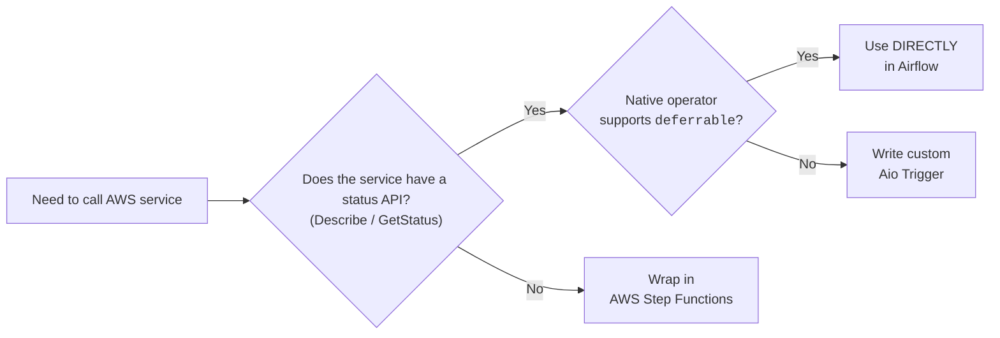

Checklist for choosing Step Functions over Airflow operator.

---

### Step 1. Analysis of the AWS Service API Architecture

An operator in Airflow is merely a wrapper around the SDK (Boto3). The reliability of the operator directly depends on **how the target service's API is structured**:

* **Polling-compatible API (Synchronous / Status Querying):** The service accepts a command, returns a `JobId` / `ExecutionArn`, and has a `Describe...` / `GetStatus...` method.
* *Examples:* ECS (`DescribeTasks`), Glue (`GetJobRun`), Redshift Data API (`DescribeStatement`).
* *Verdict:* **The operator will work great.**
* **Event-Driven API (Fire-and-Forget):** The service accepts a command, returns an `ExecutionId`, but **does not have** a status check method. The execution report goes exclusively to EventBridge / SQS / SNS.
* *Examples:* AWS Transfer Family (SFTP Connector), S3 Batch Operations.
* *Verdict:* **A direct Airflow operator will not fit** (or will be "blind"). It needs to be wrapped in Step Functions or listen to SQS.

---

### Step 2. Operator Source Code Audit

Don't trust the operator's name — open its source code on GitHub in the `apache/airflow` repository (in the `airflow/providers/amazon/aws/` folder).

Look for 3 key things:

1. **Presence of the `deferrable=True` parameter:**

* The operator class must include the `deferrable: bool = False` (or `deferrable: bool = True`) parameter.
* There must be a `self.defer(...)` call in the `execute()` method.

2. **Presence of an Async Trigger (`AioHook` / `Trigger`):**

* The operator file (or an adjacent `triggers/` file) must contain a subclass of `BaseTrigger`.
* It must use asynchronous Boto3 calls (via `aiobotocore`) to poll AWS from the `Triggerer` process without blocking the worker.

3. **Handling of `TaskInstance` upon restart:**

* Make sure the `execute()` method handles re-execution: if a task fails and restarts, does it create a new `JobId` or can it pick up an existing one?

---

### Step 3. Chaos Testing

Before pushing the operator to Prod, test its reaction to 4 standard types of failures:

1. **Network Timeout / Transient Error Test:**

* *Scenario:* Block access to the AWS API for 30 seconds while the task is running.
* *Expectation:* The operator should correctly handle `retries` at the Boto3/Triggerer level without crashing the entire DAG.

2. **`Triggerer` Service Restart Test:**

* *Scenario:* Launch a long pipeline (e.g., a 20-minute Fargate task) and forcefully restart/kill the `airflow triggerer` process.
* *Expectation:* After coming back up, the `Triggerer` should pick up the "deferred" task from the database and continue waiting without state loss.

3. **Forceful Cancellation Test (SIGTERM / Kill DAG Run):**

* *Scenario:* Cancel the DAG run in the Airflow UI while the task is in the `deferred` state.
* *Expectation:* The operator must call the `on_kill()` method and forcefully stop the process in AWS (e.g., run `StopTask` in ECS) to avoid wasting money in the cloud on idle resources.

4. **Excessive Batching Test:**

* *Scenario:* Pass an array of 1000+ objects into the operator.
* *Expectation:* The operator must not crash with OOM (Out of Memory) or hit AWS API limits (Rate Limits / Throttling).

---

### Step 4. Final Decision Matrix

