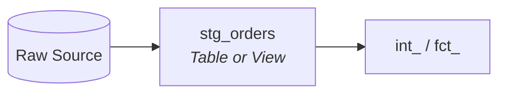

# Simple Staging: The Standard Pattern

For datasets that are relatively small (under 1M rows), simple lookups, or static reference data, don't over-engineer. A direct **Raw to Staging** pattern is faster to build and easier to maintain.

## The Workflow



---

## When to use this
*   **Dimensions:** Any table under 1M rows.
*   **Lookups:** Small reference tables (e.g., country codes, currency mappings).
*   **Seed Data:** Data loaded via `dbt seed`.
*   **Low Frequency:** Data that only updates once a day or less.

## Implementation

In this pattern, the staging model performs light cleaning (renaming, casting) and is materialized as a `view` (for maximum freshness) or a `table` (if downstream performance is a concern).

```sql
-- stg_country_codes.sql
{{ config(materialized='view') }}

select
    iso_code as country_code,
    country_name,
    region
from {{ source('raw', 'country_codes') }}
```

## Why this is enough
1.  **Low Risk:** If a test fails, the impact is minimal and easily corrected with a full refresh.
2.  **DAG Simplicity:** You avoid adding extra "Transit" models to our lineage for data that Redshift can scan in milliseconds.
3.  **Maintenance:** One model to update, document, and test.

---

**Note:** If your source data grows significantly or becomes a bottleneck for downstream models, migrate it to the [Transit Pattern](dbt_staging.md)
