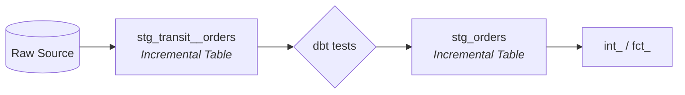

# Staging Pattern: Transit → Validate → Persist

For high-volume sources, we use a three-layer staging architecture. This pattern is non-negotiable for models where the raw source exceeds 100M rows.



## Why we use this
1.  **Safety:** Bad source batches never reach our historical staging tables.
2.  **Self-Healing:** Late-arriving records (up to 7 days) are automatically recovered.
3.  **Efficiency:** Expensive raw tables are scanned **exactly once** per run.
4.  **Debugging:** If a test fails, you can query the Transit table to see the "bad" data immediately.

---

## Layer 1: Transit
**Model:** `stg_transit__[source]`
**Materialization:** `incremental`

This layer creates a small, recent working set that is cheap to test and reprocess.

```sql
-- stg_transit__orders.sql
{{
    config(
        materialized='incremental',
        unique_key='order_id',
        incremental_strategy='delete+insert',
        sortkey='updated_at'
    )
}}

select *
from {{ source('raw', 'orders') }}
where 

    -- We re-process 7 days every run to catch late arrivals and upstream fixes.
    -- Because we use delete+insert, duplicates are handled automatically.
    updated_at >= (select max(updated_at) - interval '7 days' from {{ this }})

    -- Initial load or full refresh (see policy below)
    updated_at >= '2020-01-01'


-- Local Dev: Stay fast. Only scan 1 day.

    and updated_at >= current_date - interval '1 day'

```

---

## Layer 2: Validation (The Gate)
All tests run against the **Transit** table. We use `dbt build` to ensure the gate works:
`dbt build --select stg_transit__orders+`

**Required Tests:**
*   **PKs:** `unique`, `not_null`
*   **Enums:** `accepted_values` on status/type fields.
*   **Business logic:** `dbt_expectations` for price > 0, dates in the past, etc.

---

## Layer 3: Persisted Staging
**Model:** `stg_[source]`
**Materialization:** `incremental`

This stores our validated historical data. **No raw source access is allowed here.**

```sql
-- stg_orders.sql
{{
    config(
        materialized='incremental',
        unique_key='order_id',
        incremental_strategy='delete+insert',
        dist='order_id',
        sortkey='updated_at'
    )
}}

select *
from {{ ref('stg_transit__orders') }}


    -- Match the transit overlap for consistency
    where updated_at >= (select max(updated_at) - interval '7 days' from {{ this }})

```

---

## Full Refresh Policy
**Full refreshes are forbidden in production.** They are too expensive and risky for our volume.

If you attempt one, the build will fail:
```sql

    {{ exceptions.raise_compiler_error("Full refresh is forbidden in production. Use backfills or targeted reprocessing.") }}

```
Recovery should be performed via targeted backfills, not full table rebuilds.

---

## Summary of Operational Benefits
*   **Failed Batch:** Transit updates -> Tests fail -> **Stage remains untouched.**
*   **Late Data:** A record arrives 5 days late -> Transit overlap captures it -> Stage overlap updates it -> **History self-heals.**
*   **Reruns:** If a job fails and you rerun it, the 7-day window ensures no data is missed during the gap.
