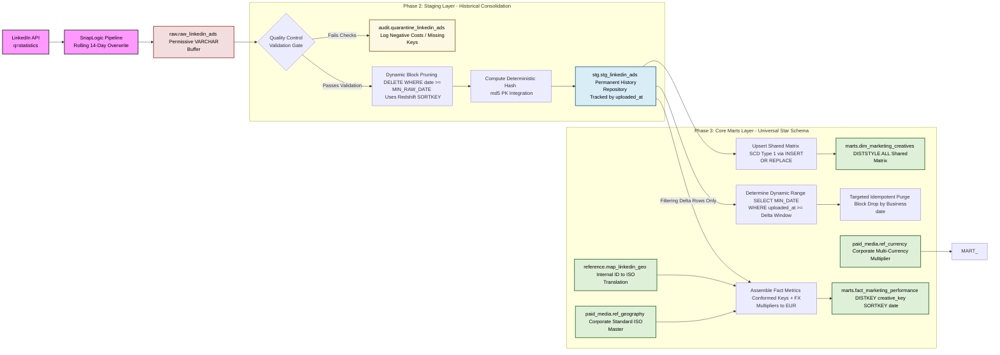

I have 4 tables: ref_currency, ref_geography, stg_google_ads, stg_linkedin_ads
i need to create source for dashboard, which is now based on dasboard_marketing_performance
Tables ddl are in the ddl.sql file in the same folder.

data to tables stg_google_ads and stg_linkedin_ads ingested daily with lookback window of 14 days.
I need to create a proper data model follow the medalliion architecture. with light stransformation on stg layer.
consider the following:
- ingestion should be incremental
- as final table should be one big table, with some views on top of it if they will be needed
- should be data quality checks, with carantine or fail, need to discuss solutions and came to decision
- set of tools: redshift, dbt. May be that will: airfow send sql to redshift. 
- ingestion at any case will be via snaplogic

When a data quality check fails, you generally have two industry-standard choices: Quarantine (separate bad rows and keep going) or Fail-Fast (crash the pipeline).

Here is the comprehensive Mermaid diagram mapping your end-to-end data architecture framework across all three phases—from the initial API extraction to the final dynamic incremental star schema model.

### Structural Pipeline Flow Highlights:

1. **The Ingestion Invariant:** SnapLogic extracts an unconditional 14-day window into the `raw` buffer table via an implicit `TRUNCATE` process, maintaining a lean operational memory footprint.
2. **The Guardrail Gate:** Valid transactions move downstream into the permanent historical `stg` matrix, whereas schema violations (negative metrics or missing granularity identifiers) are immediately dropped into the dedicated `audit` context.
3. **The Micro-Batch Optimization:** The `DELETE` operations inside Phase 2 and Phase 3 utilize subqueries checking the minimum business `date` against indexed target rows. This guarantees that your cluster executes rapid block-level disk truncations (**Zone Maps**) rather than crawling across millions of records.