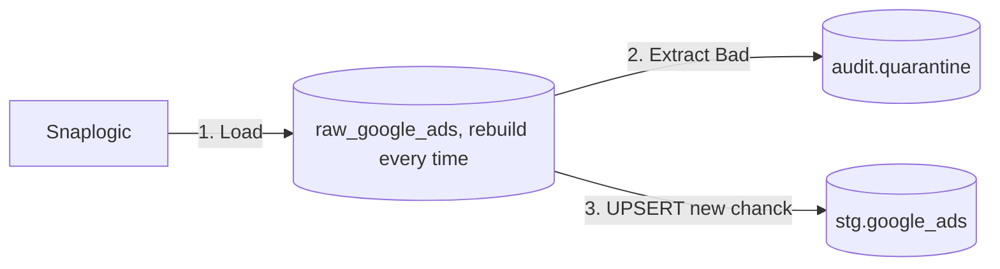

## The "Insert-Quarantine-First" Pattern

Instead of tracking complex boolean flags in memory, this pattern dumps invalid records into a dedicated quarantine table *first*, runs a simple `COUNT` comparison for the circuit breaker, and updates production only if the threshold is safe.


---

## tables description
### raw_google_ads: 
landing table for google ads from snaplogic, contains data for last loolback window (10 days), 
recreates every run

## 3-Step Execution Blueprint

### 1. Quarantine First

Isolate bad records directly from the landing table using business logic. Generate a deterministic `surrogate_key` (e.g., an MD5 hash of the natural keys) for later tracking and self-healing.

```sql
INSERT INTO audit.quarantine_table (surrogate_key, order_id, amount, reason)
SELECT 
    MD5(order_id) AS surrogate_key,
    order_id,
    amount,
    'Negative Amount'
FROM raw.landing_table
WHERE amount < 0; -- Your business rule

```

### 3. Clean Ingestion via Anti-Join

If the circuit breaker passes, load the valid records into your production staging layer. Use an `NOT IN` or `LEFT JOIN ... WHERE IS NULL` anti-join against the quarantine table using the `surrogate_key`.

```sql
INSERT INTO stg.orders
SELECT * 
FROM raw.landing_table
WHERE MD5(order_id) NOT EXISTS (
    SELECT surrogate_key FROM audit.quarantine_table
);

```

---

## Why This Works Best

* **Zero Target Pollution:** If the pipeline crashes at Step 2, your clean staging tables are never touched—preventing downstream dashboards from showing partial or corrupt data.
* **No Complex State Management:** Avoids heavy SQL logic, complex CTE tracking, or transaction rollbacks.
* **Built-in Self-Healing:** Since `raw.landing_table` is overwritten every run, if a previously quarantined record is fixed upstream and resent, its hash will no longer match the *new* quarantine batch, allowing it to naturally pass into production.