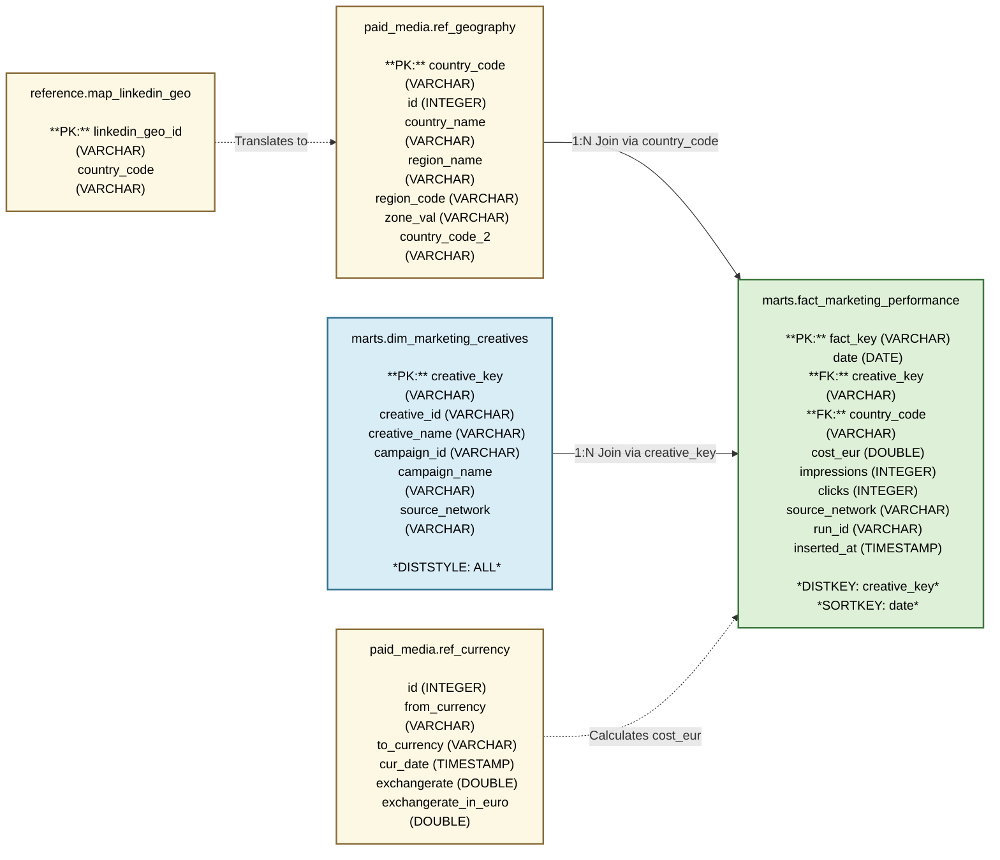

Вот горизонтальная схема (`graph LR`) итоговой структуры **Star Schema** (слой `marts`), включая таблицы связей (`reference` и `paid_media`), со всеми типами данных и указанием полей распределения/сортировки для Redshift:

