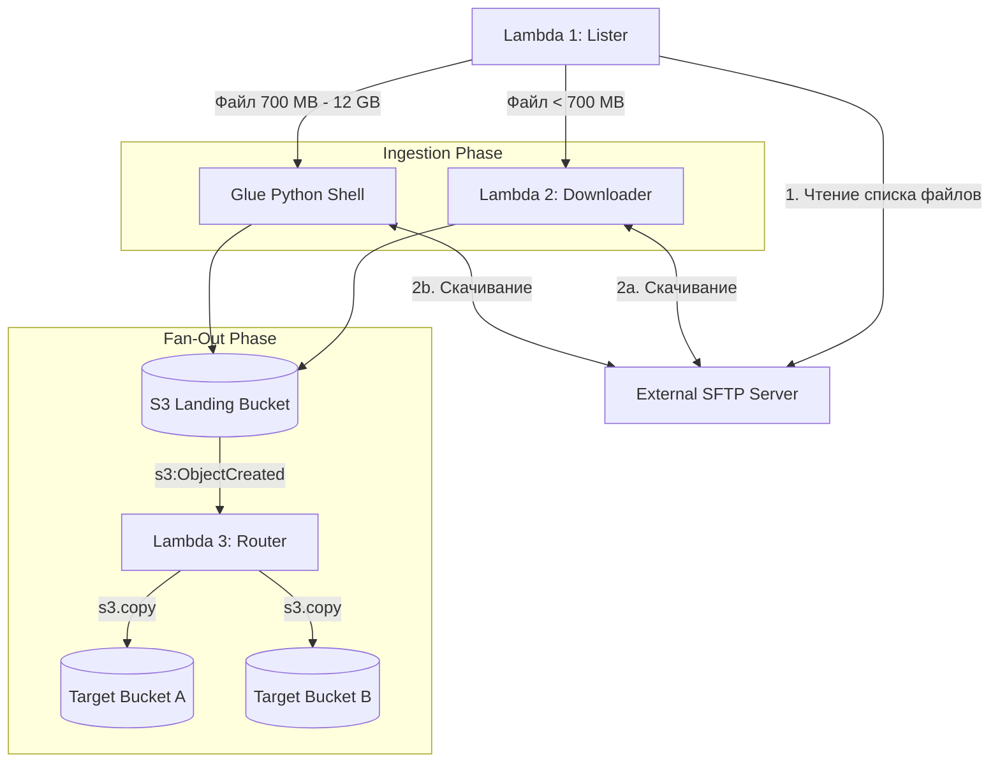

# Architecture Specification: SFTP Data Ingestion & Fan-out Engine

This document provides a comprehensive architectural overview and technical specification for building a resilient, scalable, and modular SFTP data ingestion pipeline on AWS.

---

## 1. System Overview & Sequence Diagram

The pipeline ingests files from an external SFTP server into an isolated AWS S3 Landing Bucket and automatically distributes (fans out) those files to multiple target S3 buckets.



---

## 2. Core Architectural Principles & Justifications

### Configurable Retention Window (`lookback_days`)

* **Behavior:** The parameter `lookback_days` (default: `60`) is passed via Terraform as the `LOOKBACK_DAYS` environment variable to Lambda 1 (Lister).
* **Optimization:** During directory traversal, files are evaluated using `st_mtime >= (now - lookback_days)`. Dropping older files early in memory reduces unnecessary `BatchGetItem` calls to DynamoDB and minimizes Step Functions payload sizes.

### Single Traversal & S3 Landing Buffer

* **SFTP Bottleneck Protection:** The external SFTP server represents the primary bandwidth and connection limit. Downloading files once to an internal S3 Landing Bucket avoids re-fetching identical data over narrow external channels.
* **AWS Backbone Speed:** Transferring data between S3 buckets via Lambda 3 occurs entirely within the AWS high-speed network.

### High-Level `s3.copy` vs. Low-Level `s3.copy_object`

* **5 GB Object Boundary:** S3 REST API limits direct `PUT Object - Copy` (`copy_object`) operations to 5 GB.
* **Multipart Copy Execution:** Lambda 3 uses `s3.copy` (Boto3 S3 Transfer Manager), which automatically manages Multipart Copy for files larger than 5 GB (supporting up to 5 TB).

### Glue Python Shell vs. PySpark

* **Startup Latency & Cost:** Glue Python Shell starts in 10–15 seconds at minimal cost (0.0625 DPU) compared to 3–5 minutes for PySpark clusters.
* **Execution Boundary:** Provides up to 24 hours of runtime, removing the AWS Lambda 15-minute timeout restriction for large files transferred over slow connections.

---

## 3. Module File Structure

```text
terraform-aws-sftp-ingestion/
├── main.tf                 # Core resources: DynamoDB, Secrets Manager
├── lambdas.tf              # Lambda 1 (Lister), Lambda 2 (Downloader), Lambda 3 (Router)
├── glue.tf                 # Glue Python Shell Job & S3 script deployment
├── step_functions.tf       # State Machine definition (ASL JSON)
├── s3.tf                   # Landing Bucket & S3 Event Notification triggers
├── iam.tf                  # IAM Roles & Least-Privilege Policies
├── variables.tf            # Module Inputs (lookback_days, size_threshold_mb, sftp_secret_arn)
├── outputs.tf              # State Machine ARN, Landing Bucket Name
└── src/
    ├── layers/
    │   └── sftp_common/    # Shared helper package (sftp_transfer_lib)
    ├── lister/             # Lambda 1 source code
    ├── downloader/         # Lambda 2 & Glue source code
    └── router/             # Lambda 3 source code

```

---

## 4. Component Technical Specifications

### DynamoDB Schema (`sftp_processed_files`)

* **Partition Key (HASH):** `file_path` (String)
* **Attributes:** `mtime` (Number), `size` (Number), `status` (String: `PENDING` | `PROCESSED` | `FAILED`), `processed_at` (String ISO-8601), `ttl` (Number)

### Step Functions Execution Rules

* **Map State:** Set `MaxConcurrency` to `2` or `3` to comply with remote SFTP `MaxStartups` limits.
* **Choice State Condition:**
* If `file_size_mb < size_threshold_mb` $\rightarrow$ Invoke Lambda 2 (Downloader).
* If `file_size_mb >= size_threshold_mb` $\rightarrow$ Invoke Glue Python Shell Job.


---